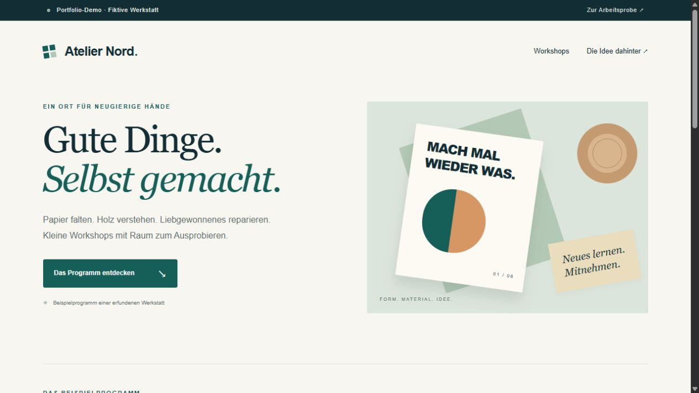
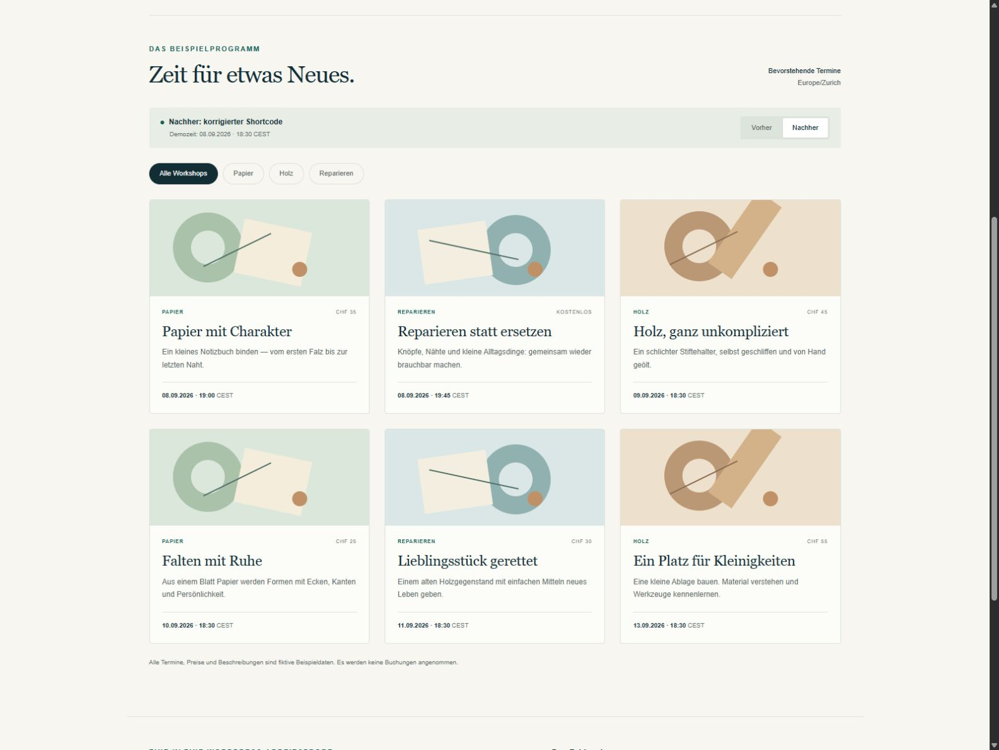

# WordPress workshop shortcode — portfolio demonstration

A small custom WordPress plugin that turns existing workshop posts into a filtered, ordered schedule. The accompanying fictitious “Atelier Nord” site demonstrates a deliberately introduced timezone defect and its correction.

**This is an intentional portfolio exercise. It is not a customer project, testimonial, third-party bug report or claim of Elementor/Divi experience. No real bookings, payments or customer data are used.**

## Screenshots from the running WordPress demonstration





[View the actual mobile layout](wordpress-demo-mobile.png).

## What the plugin does

```text
[atelier_schedule]
[atelier_schedule topic="papier" limit="3"]
```

- Reads published `atelier_workshop` posts through real `WP_Query`.
- Filters by the `atelier_topic` taxonomy; an unknown topic has a useful empty state.
- Includes workshops whose start is now or later and orders them by their actual start instant.
- Preserves the page's main post context.
- Provides WordPress editor fields for a local start date/time and a CHF example fee. `0` displays as “Kostenlos”.

The plugin stores `_atelier_start_utc` as a genuine Unix timestamp. The WordPress site's timezone controls display and the editor's local-time conversion.

Editor policy at clock changes: saving an unchanged displayed minute preserves its existing UTC instant, including any stored seconds. A **new or changed** ambiguous local time selects the **later occurrence** using the timezone's adjacent offsets. For example, a new Zurich `2030-10-27 02:30` becomes `01:30 UTC`; an unchanged entry already stored as `00:30 UTC` keeps that earlier instant. Invalid dates and nonexistent spring-forward times leave the previous value untouched. This policy also appears beside the editor field.

## The specific correction

A legacy WordPress timestamp obtained from `current_time('timestamp')` includes the site's GMT offset. Comparing that value with genuine Unix timestamps shifts the cutoff. In Zurich during summer, a workshop starting in 30 minutes disappears roughly two hours too soon; in a negative-offset timezone, already-started workshops can reappear.

The fixed code compares `current_datetime()->getTimestamp()` with stored Unix timestamps and uses `wp_date()` for local display. The intentionally faulty behavior exists only in `demo/legacy-shortcode.php`; the distributable `atelier-workshops` plugin never loads it.

Primary API contracts:

- [WordPress current_time](https://developer.wordpress.org/reference/functions/current_time/) documents the offset-bearing result when GMT is false.
- [WordPress current_datetime](https://developer.wordpress.org/reference/functions/current_datetime/) returns a DateTimeImmutable in the site's timezone.
- [WordPress wp_date](https://developer.wordpress.org/reference/functions/wp_date/) formats a genuine timestamp in the selected timezone.
- [WordPress WP_Query](https://developer.wordpress.org/reference/classes/wp_query/) provides the taxonomy, publication status and numeric metadata query behavior used here.
- [PHP DateTimeZone::getTransitions](https://www.php.net/manual/en/datetimezone.gettransitions.php) supplies transition offsets in seconds; fixed-offset zones have no transitions. The plugin uses these offsets to resolve new ambiguous input explicitly.

## Files

```text
atelier-workshops/        Standalone custom plugin; contains the corrected code
atelier-portfolio-theme/ Fictitious demonstration theme
demo/                    Explicit BEFORE fixture, frozen demo clock and sample content
tests/                   Integration tests and a self-contained SQLite test bootstrap
```

Only this source directory is intended for publication. WordPress core, PHP binaries, SQLite plugin binaries, local databases, server logs and administrator credentials are excluded.

## Try the plugin in a disposable WordPress site

1. Copy `atelier-workshops/` into `wp-content/plugins/`, then activate **Atelier Workshop Schedule**.
2. In **Workshops**, create published entries with a start date/time, excerpt, topic and optional fee. Editor input uses the site's configured timezone.
3. Add `[atelier_schedule]` to a page. Use `topic` and `limit` when needed.

The plugin works independently of the demonstration theme. This exercise was actually run against WordPress 7.1 with the official SQLite integration 3.0.1; other WordPress/database combinations have not been claimed as tested.

The plugin emits the schedule HTML and class names. The accompanying `atelier-portfolio-theme/style.css` supplies the demonstration's card layout, colors and decorative shapes; that appearance is not bundled into the standalone plugin. An existing site can style the shortcode with its own theme or custom CSS.

## Recreate the optional before/after site

Use a disposable local installation with the plugin active. Copy the theme into `wp-content/themes/`. Copy `demo/` to `wp-content/mu-plugins/atelier-demo/`, then create this root-level mu-plugin:

```php
<?php
require __DIR__ . '/atelier-demo/environment.php';
```

From CLI, bootstrap that local WordPress installation and require `wp-content/mu-plugins/atelier-demo/seed.php`. The seed creates clearly marked fictional posts, sets the fixed demonstration clock to **8 September 2026, 18:30 Europe/Zurich**, and activates the demonstration theme. It only replaces posts marked `_atelier_demo_fixture`; it is nevertheless intended exclusively for a disposable portfolio site.

The page's **Vorher/Nachher** control switches between the faulty fixture and corrected shortcode using the same stored content. The fixture yields four upcoming cards; the correction yields six. The topic filters work in both modes. The page identifies the frozen demo clock and fictitious content visibly.

## Actual validation

Executed locally with **PHP 8.4.25**, **WordPress 7.1**, **SQLite Database Integration 3.0.1** and **SQLite 3.53.4**:

**11 tests passed, 0 failed**, using genuine WordPress functions, hooks, `WP_Query`, shortcodes, user capabilities, editor-save hooks and a separate SQLite test database. No WordPress or database functions were mocked. The three additional editor regression cases failed against the preceding plugin code and pass with the correction.

1. UTC: past excluded, exact start included, chronological order.
2. Zurich summer: next-hour event retained; faulty fixture demonstrably loses it.
3. New York: negative offset does not reintroduce past events.
4. Kathmandu: fractional offset affects display only.
5. Autumn DST repeated hour: identical wall-clock labels remain distinct instants.
6. Real shortcode filtering, limit, draft exclusion and empty state.
7. Main WordPress post remains unchanged after rendering the shortcode.
8. WordPress editor save converts local input to UTC storage and back to the correct display.
9. Unchanged first and second occurrences of Zurich's autumn 02:30 both preserve their UTC instants.
10. Newly entered ambiguous times select the later occurrence in Zurich and New York.
11. An unchanged minute preserves stored seconds; a nonexistent spring-forward input cannot overwrite it.

HTTP checks additionally returned 200 and verified 6 corrected cards / 4 faulty cards / 2 paper-topic cards. The PHP source files passed syntax checks. Separate browser review checked a 1280px desktop viewport and a 375 × 812px mobile viewport, found no horizontal overflow, and confirmed visible keyboard focus and the before/after/topic controls. The CLI integration tests do not assess appearance.

## Run the real WordPress tests

Use PHP 8.4 with the `pdo_sqlite`, `sqlite3` and `mbstring` extensions enabled. No Composer dependencies, database server, browser or running HTTP server are needed.

1. Extract [WordPress 7.1](https://downloads.wordpress.org/release/wordpress-7.1.zip) to a disposable directory. Do not use a live site's files: WordPress also loads any installed mu-plugins during bootstrap.
2. Extract the official [SQLite Database Integration 3.0.1](https://downloads.wordpress.org/plugin/sqlite-database-integration.3.0.1.zip) into that directory's `wp-content/plugins/sqlite-database-integration/`.
3. Copy that plugin's `db.copy` to `wp-content/db.php`.
4. Copy this repository's `atelier-workshops/` directory into `wp-content/plugins/`.
5. From this source directory, run the following commands, replacing the WordPress root with the extracted directory:

```powershell
$env:WP_DEMO_TEST = '1'
$env:ATELIER_WORDPRESS_ROOT = 'C:\path\to\disposable\wordpress'
php tests/regression.php tests/bootstrap.php
```

Or with a POSIX shell:

```sh
WP_DEMO_TEST=1 ATELIER_WORDPRESS_ROOT=/path/to/disposable/wordpress \
  php tests/regression.php tests/bootstrap.php
```

The supplied `tests/bootstrap.php` provides the complete test configuration: it bypasses an existing `wp-config.php`, installs WordPress automatically into `tests/.test-data/tests.sqlite`, blocks WordPress HTTP requests and mail, and disables cron and automatic updates. No administrator login or password is needed or printed. An optional `ATELIER_TEST_DATA_DIR` selects another disposable data directory; the database filename must remain `tests.sqlite`. The default data folder is excluded in `.gitignore` and must never be published.

The suite creates its own temporary user with the WordPress **Editor** role, verifies the real edit capability, and removes that user and its workshop fixtures after execution, including failed assertions. It does not depend on an existing administrator username. The SQLite database remains for repeat runs; selecting a new empty data directory also exercises first-install bootstrap. Both first-install and repeat runs were executed successfully. Other installed plugins, web authentication and browser appearance are outside this CLI test's scope.

## Scope

This sample demonstrates a focused PHP/WordPress content shortcode and a concrete correctness fix. It does not claim full booking functionality, payment processing, page-builder specialization, production-scale load testing or a third-party plugin compatibility audit.

Code license: [GPL-2.0-or-later](LICENSE). WordPress and the SQLite integration retain their own licenses and are not bundled in this source directory.
